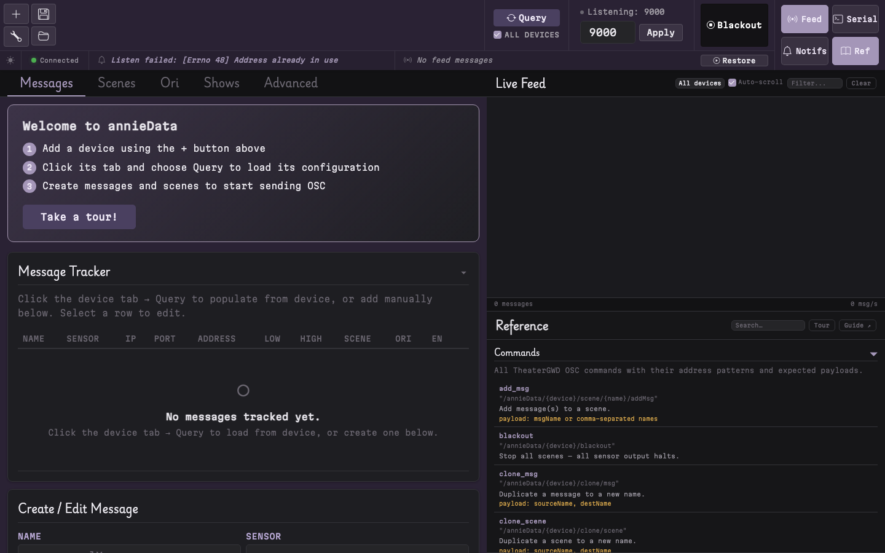
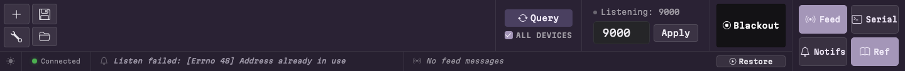
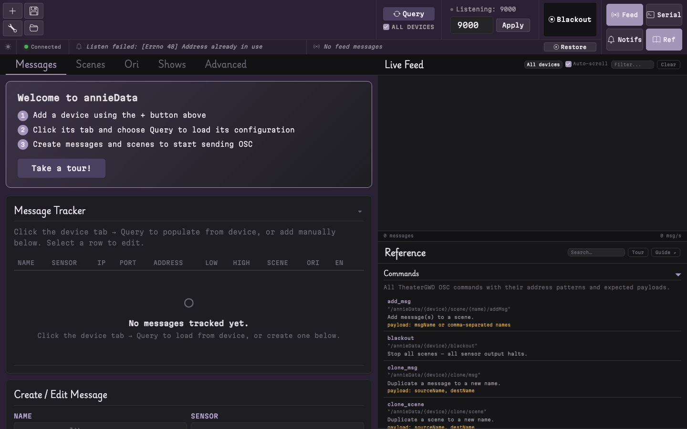
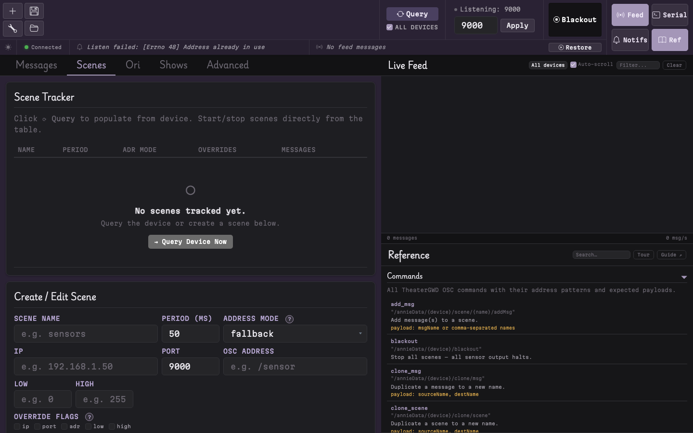
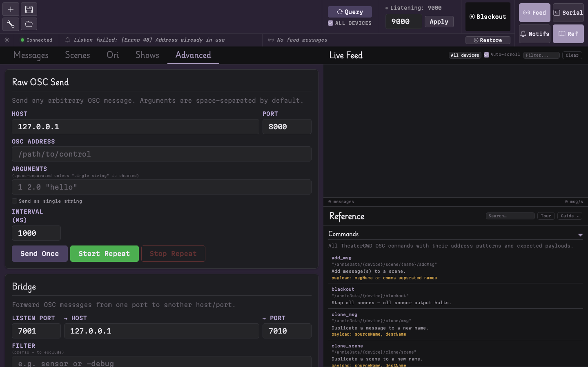
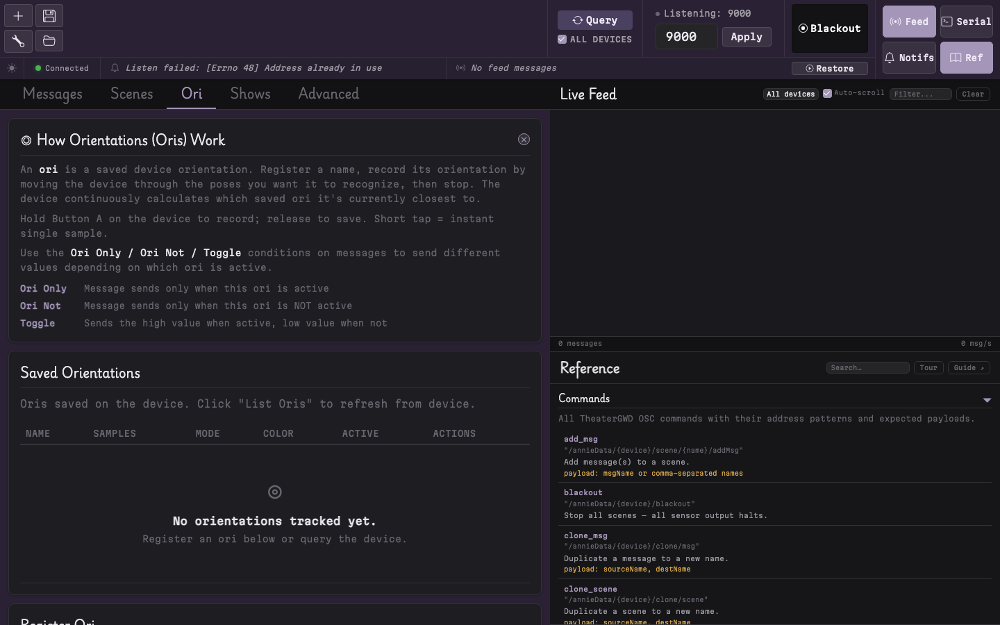
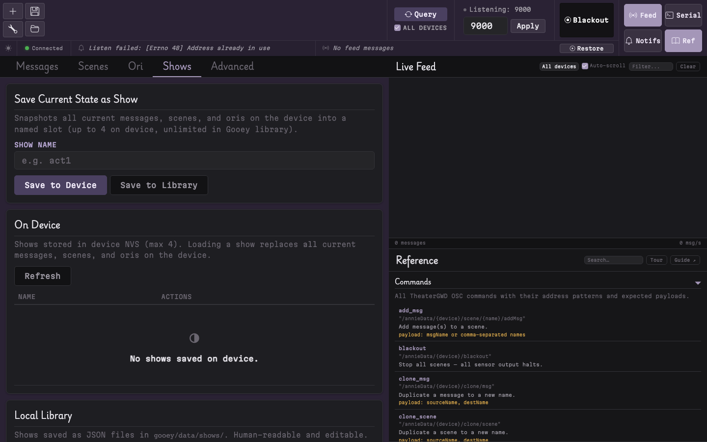
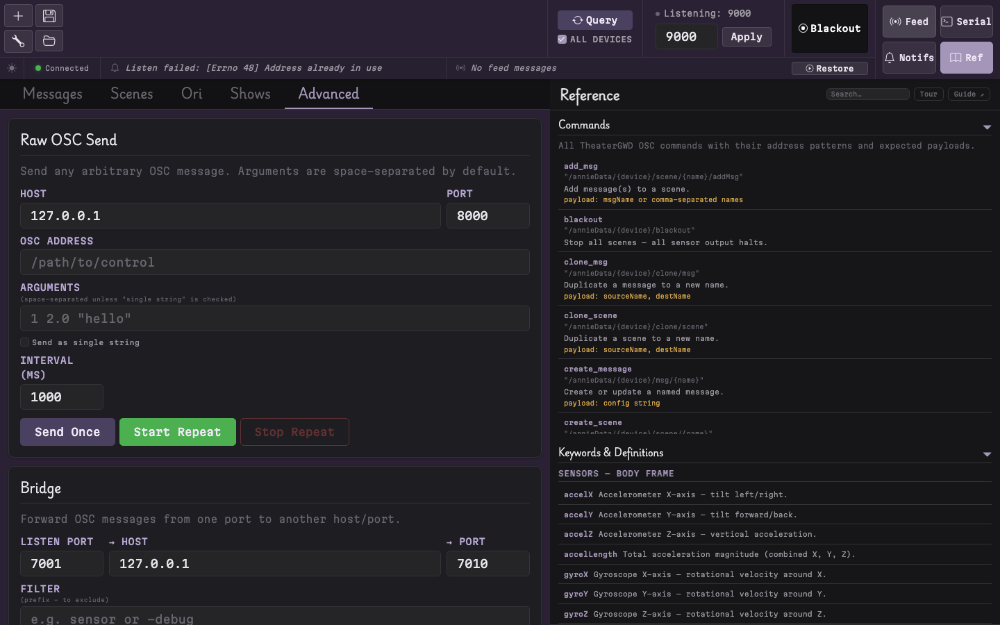
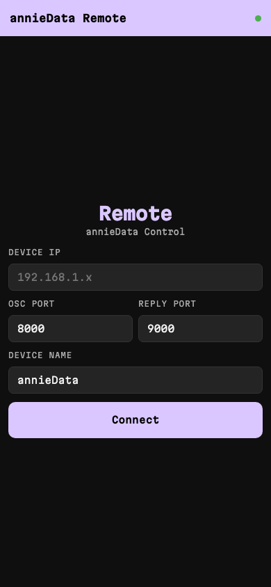
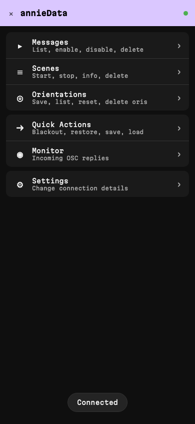

# GUI Guide

The annieData Control Center is the primary graphical interface for TheaterGWD sensor devices. It enables operators to configure messages, monitor OSC traffic, and control scenes — all from a browser, no raw OSC commands required.

---

## Table of Contents

- [What is the annieData Control Center?](#what-is-the-anniedata-control-center)
- [Installation](#installation)
- [First Launch](#first-launch)
- [Connecting to a Device](#connecting-to-a-device)
- [The Layout](#the-layout)
- [Messages Tab](#messages-tab)
- [Scenes Tab](#scenes-tab)
- [Direct Tab](#direct-tab)
- [Ori Tab (ab7 only)](#ori-tab-ab7-only)
- [Shows Tab](#shows-tab)
- [Advanced Tab](#advanced-tab)
- [The Live Feed](#the-live-feed)
- [Serial Terminal](#serial-terminal)
- [Reference Panel](#reference-panel)
- [Mobile Remote](#mobile-remote)
- [Multi-Device Setup](#multi-device-setup)
- [Dark/Light Theme](#darklight-theme)
- [Practical Theater Workflows](#practical-theater-workflows)
- [Troubleshooting](#troubleshooting)

---

## What is the annieData Control Center?

The annieData Control Center is a web application that runs locally and opens in the operator's browser. It communicates with TheaterGWD sensor devices over WiFi using OSC messages.

The interface uses a **split-panel layout**:
- **Left panel** — control tabs for Messages, Scenes, Ori, Shows, and Advanced
- **Right panel** — live OSC feed, serial terminal, notifications, and command reference

Every operation available via raw OSC commands is also accessible through the annieData interface — along with visual message trackers, show file management, Python scripting, and a mobile remote.


*The annieData Control Center with the Messages tab open and the live feed on the right.*

---

## Installation

### macOS (Homebrew) — recommended

```bash
brew install halfsohappy/theatergwd/gooey
```

### Linux (snap)

```bash
sudo snap install gooey-theatergwd
```

### Arch / Manjaro (AUR)

```bash
yay -S gooey-theatergwd
```

### pip (any platform)

```bash
pip install gooey-theatergwd
```

A virtual environment is recommended:

```bash
python3 -m venv gooey-env
source gooey-env/bin/activate
pip install gooey-theatergwd
```

### Installer script

```bash
git clone https://github.com/halfsohappy/TheaterGWD.git
cd TheaterGWD/gooey
bash install.sh
```

### Manual

```bash
git clone https://github.com/halfsohappy/TheaterGWD.git
cd TheaterGWD/gooey
python3 -m venv venv
source venv/bin/activate
pip install -r requirements.txt
python run.py
```

---

## First Launch

Launch annieData from the terminal:

```bash
gooey
```

The default browser opens automatically to **http://127.0.0.1:5000**.

### Command-line options

| Flag | Description |
|------|-------------|
| `--port PORT` | Use a different port (default: 5000) |
| `--host 0.0.0.0` | Allow access from other devices on the network |
| `--no-browser` | Don't auto-open the browser |
| `--debug` | Enable Flask debug mode |

Example — expose annieData to other machines on the network:

```bash
gooey --host 0.0.0.0 --port 8080
```


*First launch — no devices connected yet.*

---

## Connecting to a Device

1. Click the **Add Device** button in the header
2. Enter the device's **IP address**, **port**, and a **name** for it
3. The device appears as a tab across the top of the screen

Click a device tab to switch context. All subsequent commands are directed to the selected device.

### Start Listener

Toggle **Start Listener** to enable reply reception from the device. This activates:
- Message info replies
- List command results
- Status updates
- Show/ori confirmations

Set the **listen port** to an available port — annieData suggests one automatically.


*Two devices connected — "bart" is selected, listener is active.*

---

## The Layout

| Area | Location | Purpose |
|------|----------|---------|
| **Header** | Top | Device tabs, add device, blackout button, theme toggle |
| **Left panel** | Left side | Main control tabs (Messages, Scenes, Ori, Shows, Advanced) |
| **Right panel** | Right side | Live feed, serial terminal, notifications, reference |
| **Divider** | Center | Drag to resize panels |

The right panel can be toggled on or off. The header buttons switch between **Feed**, **Serial**, **Notifs** (notifications), and **Ref** (command reference).

---

## Messages Tab

The Messages tab displays all messages configured on the selected device and provides controls for creating, editing, and managing them.

### Message Tracker

The tracker table lists every message with the following columns:

| Column | Description |
|--------|-------------|
| **Name** | Message name |
| **Sensor** | Which sensor value it reads (accelX, gyroLength, etc.) |
| **IP** | Destination IP address |
| **Port** | Destination port |
| **Address** | OSC address it sends to |
| **Low** | Minimum output value |
| **High** | Maximum output value |
| **Scene** | Which scene(s) it belongs to |
| **Ori** | Orientation conditions (if any) |
| **EN** | Enabled/disabled status |

Select any row to reveal its action buttons.


*The message tracker with five messages configured.*

### Creating a message

1. Click **New Message** below the tracker
2. Fill in the form:
   - **Name** — a short identifier (e.g., "dimmer1")
   - **Value** — pick a sensor from the dropdown (e.g., accelX)
   - **IP** — destination IP address
   - **Port** — destination UDP port
   - **Address** — OSC address path (e.g., /dmx/1)
   - **Low / High** — output value range
   - **Scene** — optionally assign to an existing scene
   - **Ori conditions** — ori_only, ori_not, or ternori (ab7 only)
3. Click **Create**


*Creating a new message mapping accelX to a lighting fader.*

### Actions

| Action | What it does |
|--------|-------------|
| **Enable** | Enable the message (it sends when its scene is running) |
| **Disable** | Disable without deleting |
| **Delete** | Remove the message entirely |
| **Info** | Query the device for the message's current state |
| **Save** | Persist to device flash (NVS) |
| **Clone** | Duplicate with a new name |
| **Rename** | Change the message name |

---

## Scenes Tab

Scenes group messages together with a shared send rate and optional overrides.

### Scene Tracker

Similar to the message tracker, but for scenes:

| Column | Description |
|--------|-------------|
| **Name** | Scene name |
| **Period** | Send interval in milliseconds |
| **IP** | Scene-level IP (if set) |
| **Port** | Scene-level port (if set) |
| **Address** | Scene-level address (if set) |
| **Low / High** | Scene-level bounds (if overriding) |
| **adrMode** | Address composition mode |
| **Messages** | Number of messages in the scene |
| **Status** | Running / Stopped |


*Two scenes — "lighting" is running, "audio" is stopped.*

### Creating a scene

1. Click **New Scene**
2. Fill in:
   - **Name** — scene identifier
   - **Period** — send interval in ms (default 50 = 20 sends/sec)
   - **IP / Port / Address** — optional scene-level defaults
   - **Low / High** — optional scene-level bounds
   - **Override** — which fields the scene forces on all its messages (ip, port, adr, low, high)
   - **Address Mode** — how scene and message addresses combine
3. Click **Create**

### Managing scenes

| Action | What it does |
|--------|-------------|
| **Start** | Begin sending all messages in the scene |
| **Stop** | Stop the scene's send task |
| **Add Messages** | Select messages to add to the scene |
| **Remove Message** | Remove a message from the scene |
| **Solo** | Enable only one message, mute all others |
| **Delete** | Remove the scene and its task |

### Address mode explained

| Mode | How the final address is built |
|------|-------------------------------|
| **Fallback** | Use message address; scene address only if message has none |
| **Override** | Scene address replaces message address |
| **Prepend** | Scene address + message address (e.g., `/mixer` + `/fader1` → `/mixer/fader1`) |
| **Append** | Message address + scene address |

### setAll

The **setAll** card applies a property change to every message in the scene at once. For example, setting all messages to output 0–255:

> Set all → low: 0, high: 255

---

## Direct Tab

The Direct tab is the fastest path to live data. It creates a message and scene in one step and begins sending immediately.

1. Choose a sensor value from the dropdown
2. Enter destination IP, port, and OSC address
3. Set period (send rate)
4. Click **Go**

Ideal for quick demos and testing — the setup can be refined later in the Messages and Scenes tabs.

The Direct tab also includes a **config builder** — operators select options from dropdowns, and annieData constructs the config string automatically.


*Direct tab — one click to start sending accelX.*

---

## Ori Tab (ab7 only)

> This tab only appears when connected to an **ab7** board.

Orientations ("oris") enable the device to recognize physical poses and conditionally trigger messages.

### What are oris?

An ori is a saved pose reference — arm raised, pointing forward, resting flat. The device continuously compares its current orientation against saved oris and reports whether a match is active.

Messages can be configured to send only when a specific pose is detected, or to emit a trigger value (1 or 0) based on the active ori.

### Saved Oris Table

Shows all saved orientations with:
- **Name** — the ori identifier
- **Color swatch** — the LED color assigned to this ori
- **Sample count** — how many quaternion samples define the pose
- **Tolerance** — match tolerance in degrees


*Three saved oris — "armUp" (green), "forward" (blue), "resting" (red).*

### Recording a new ori

1. Click **Record New**
2. Enter a name for the orientation
3. Click **Start Recording**
4. Hold the device in the desired pose for 3–5 seconds
5. Click **Stop Recording**

The status indicator displays recording progress. After stopping, the device processes the samples and stores the ori.

The **instant-save** option captures a single snapshot instead of a timed recording.

### Settings

| Setting | Description |
|---------|-------------|
| **Tolerance** | How close the device needs to be to match (degrees). Higher = more forgiving. Default: 10. |
| **Threshold** | Minimum motion speed to consider matching (rad/s). Filters out noise when still. |
| **Strict mode** | When on, if no ori is close enough, none is active. When off, the closest ori always wins. |

### Assigning ori conditions to messages

When creating or editing a message in the Messages tab, the following ori conditions are available:

- **ori_only** — message only sends when this ori is active
- **ori_not** — message is suppressed when this ori is active
- **ternori** — message sends 1.0 when ori matches, 0.0 otherwise

---

## Shows Tab

Shows are named snapshots of the entire device state — all messages, scenes, and oris.

### Saving a show

1. Enter a name in the **Save Show** field
2. Click **Save**

### On-Device shows (NVS)

Stored on the device's flash memory. These persist across power cycles.

| Column | Description |
|--------|-------------|
| **Name** | Show name |
| **Load** | Load this show (requires confirmation) |
| **Delete** | Remove from device |

Maximum: **16 shows** on-device.

### Local Library shows

Stored as JSON files on the host computer (in `gooey/data/shows/`). No limit on count.

| Column | Description |
|--------|-------------|
| **Name** | Show name |
| **Timestamp** | When it was saved |
| **Load** | Push to device |
| **Delete** | Remove file |

### Loading a show

Loading is a **two-step** process to prevent accidents:

1. Click **Load** on a show
2. A confirmation dialog appears
3. Click **Confirm** to apply

This replaces all current messages, scenes, and oris on the device.


*Shows tab — 3 shows on-device, 5 in the local library.*

---

## Advanced Tab

### Raw OSC Send

Accepts any OSC address and arguments for direct transmission to the device — useful for testing commands or sending one-off messages.

### JSON Batch Send

Accepts a JSON array of messages for batch transmission, optionally with intervals between them:

```json
[
  {"address": "/annieData/bart/msg/dim1", "args": ["value:accelX, ip:192.168.1.50, port:9000, adr:/fader/1"]},
  {"address": "/annieData/bart/scene/main/addMsg", "args": ["dim1"]},
  {"address": "/annieData/bart/scene/main/start", "args": []}
]
```

### OSC Bridge

Relays incoming OSC from one port to the device — useful when external software sends OSC but cannot target the device directly.

- **Listen Port** — port to receive on
- **Forward to** — device IP and port

### Euler Tare

- **Set Tare** — capture current orientation as zero reference
- **Reset Tare** — clear the reference

### Mobile Remote QR Code

Generates a QR code that opens the mobile remote interface on a phone. See [Mobile Remote](#mobile-remote).

---

## The Live Feed

The right panel's **Feed** view shows every OSC message sent and received in real time.

| Visual | Meaning |
|--------|---------|
| **Purple** | Outgoing messages (sent to device) |
| **Green** | Incoming messages (received from device) |

### Features

- **Auto-scroll** — follows new messages as they arrive
- **Text filter** — search for specific addresses or values
- **Device filter** — show messages for one device only
- **Stats** — message count, rate, last update time
- **Clear** — wipe the feed

The feed stores up to 500 messages. Older messages are dropped.


*Live feed — purple outgoing commands, green incoming replies.*

---

## Serial Terminal

The serial terminal provides a direct USB connection to the device for viewing serial output and sending commands.

1. Open the **Serial** panel (right side)
2. Select the serial port from the dropdown
3. Set baud rate (default: 115200)
4. Click **Connect**

Commands can be typed in the input field and sent directly to the device. Serial output appears in the terminal view.

Particularly useful for debugging — the device prints status messages, errors, and sensor readings to serial.

---

## Reference Panel

The **Ref** panel is a searchable command reference built into annieData. It covers:

- All OSC commands with syntax and examples
- Config string keys and valid values
- Address mode descriptions
- Sensor value names

The search box filters results in real time — no need to leave the application to look up a command.

---

## Mobile Remote

The annieData Control Center includes a mobile-optimized remote control interface.

### Getting started

1. Ensure annieData is running with `--host 0.0.0.0` so it is accessible on the network
2. On a mobile device, navigate to `http://{host-ip}:5000/remote`
3. Alternatively, scan the **QR code** generated in the Advanced tab


*Mobile remote — enter device connection details.*

### Connect screen

Enter:
- Device IP and port
- A listen port (for receiving replies)
- Device name

### Main menu

After connecting, you see cards for:

| Card | What it does |
|------|-------------|
| **Messages** | View and control all messages |
| **Scenes** | View and control all scenes |
| **Orientations** | Manage oris (ab7 only) |
| **Quick Actions** | Blackout, restore, save, load, list, NVS clear |
| **Monitor** | Live feed of incoming OSC replies |
| **Settings** | Edit connection details |


*Mobile remote main menu — tap any card to navigate.*

The mobile remote is a **Progressive Web App (PWA)** — it can be added to the home screen on iOS or Android for a native app experience.

---

## Multi-Device Setup

The interface supports simultaneous control of multiple sensor devices:

1. Click **Add Device** for each sensor
2. Device tabs appear across the top
3. Click a tab to switch the active device
4. Check **"All devices"** to broadcast commands to every connected device at once

Each device maintains its own message/scene registry. The live feed displays traffic for all devices — filter by device name as needed.

---

## Dark/Light Theme

The **theme toggle** in the bottom-right corner of the header switches between dark and light modes. The preference persists in the browser.

---

## Practical Theater Workflows

### Rehearsal quick start

1. Launch annieData: `gooey`
2. Add the device (IP + port)
3. Open the **Direct tab**
4. Select `accelLength`, enter the console's IP/port/address
5. Click **Go**
6. Verify values are flowing in the live feed

### Multi-sensor rig

1. Go to **Messages tab** → create one message per sensor mapping
2. Go to **Scenes tab** → create a scene, add all messages
3. Set the scene's **period** (e.g., 50ms for responsive, 100ms for less traffic)
4. Click **Start**
5. Use **Solo** to test individual messages

### Blackout + Restore during show

- **Blackout** button in the header instantly stops all scenes on the selected device
- **Restore** restarts them — no need to reconfigure

### Saving and recalling between rehearsals

1. After rehearsal, open the **Shows tab**
2. Save as "rehearsal_tuesday"
3. The following day, load it to resume where work left off
4. Save to both **on-device** (persists across power cycles) and **local library** (backup on the host machine)

### Debugging with solo and feed filtering

1. Open the scene in the **Scenes tab**
2. Click **Solo** on the suspect message
3. Check the **Feed** — confirm the message is sending and values are changing
4. Click **Info** on the message — verify IP, port, and address are correct
5. **Unsolo** when finished

---

## Troubleshooting

### Device not responding

- Confirm the device is powered on and connected to the same WiFi network
- Verify the device IP — try `ping 192.168.1.100`
- Ensure the port matches the device's provisioned port
- Confirm the device name matches the provisioned name exactly

### Values not arriving at your console

- Check the **Feed** — purple messages should appear if data is being sent
- Click **Info** on the message — verify IP, port, and address match the console's settings
- Confirm the scene is **started**, not just created
- Confirm the message is **enabled**
- Verify the console's OSC listener is active on the correct port

### Listener not receiving replies

- Confirm **Start Listener** is toggled on
- Verify the listen port is not in use by another application
- Note: the device sends replies to the IP and port from which it received the command

### Browser won't open

- Navigate manually to `http://127.0.0.1:5000`
- If using `--host 0.0.0.0`, use the host machine's actual IP address
- Check the terminal output for errors

### Serial port not showing

- Confirm the device is connected via USB
- On macOS, a USB driver for the ESP32 may be required
- Verify no other application (Arduino IDE, PlatformIO monitor) holds the port open

### Mobile remote can't connect

- annieData must be running with `--host 0.0.0.0`
- The mobile device must be on the same WiFi network
- Try the IP address shown in the QR code directly
- Verify the host machine's firewall allows traffic on port 5000
